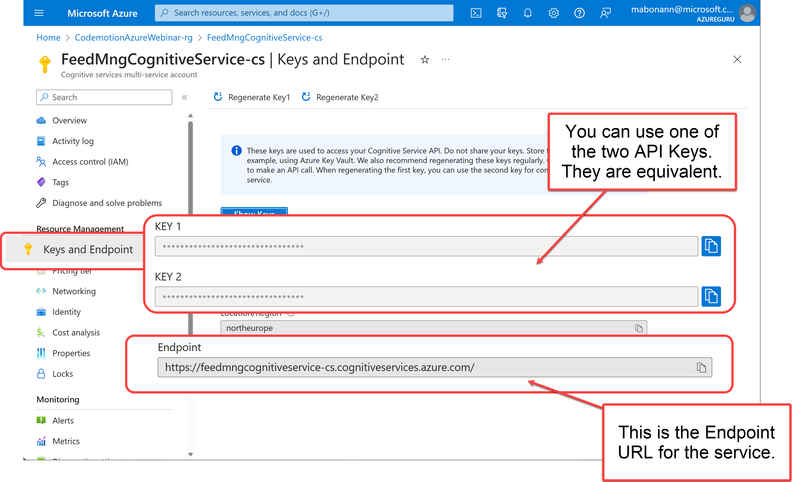
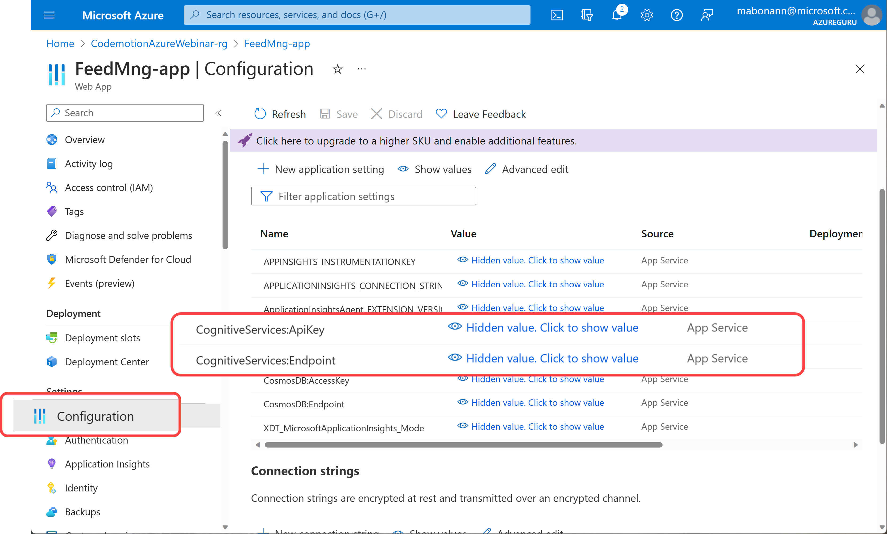

# Cognitive Services library

This project contains the implementation of the interface [IFeedbackAnalyzer](../FeedbackManager.Core/Interfaces/IFeedbackAnalyzer.cs) to extract the sentiment from a feedback using the sentiment analysis opinion mining in Cognitive Services for Language ([documentation](https://learn.microsoft.com/en-us/azure/cognitive-services/language-service/sentiment-opinion-mining/overview)).

## Library Configuration
The library needs the `ApiKey` and the `Service Endpoint` of the Cognitive Service instance you are using.

### Configuration file
The following is the section in the configuration file for the library:

```json
{
  ...
  "CognitiveServices": {
    "ApiKey": "<APIKey>",
    "Endpoint": "<Service Endpoint>"
  },
  ...
}
```

You can retrieve `APIKey` and `Endpoint` in the Azure Portal, in the *"Keys and Endpoint"* blade of the Cognitive Service instance: 



### AppService Configuration
To configure the *"Configuration"* blade of the App Service, you must add the keys `CognitiveServices:ApiKey` and `CognitiveServices:Endpoint` as following:

