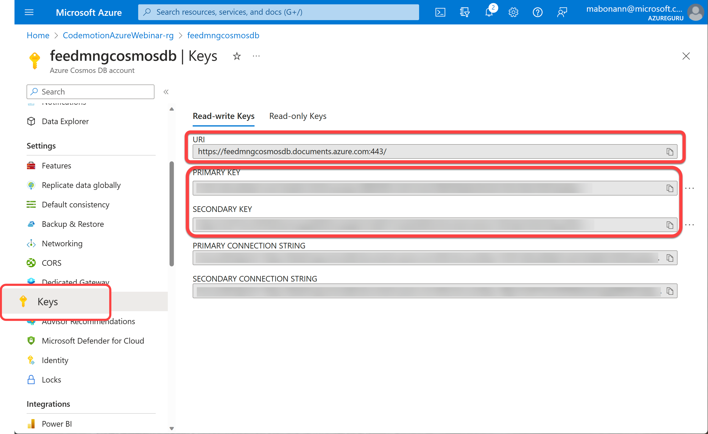
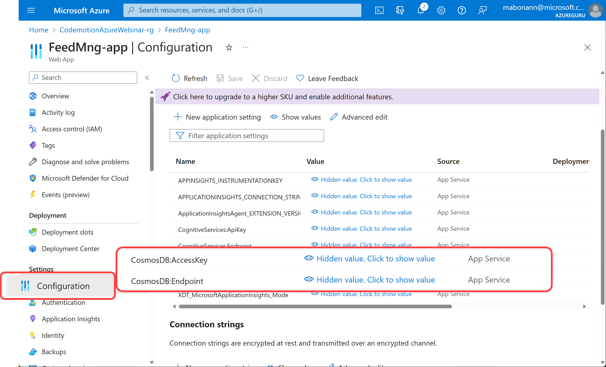

# CosmosDB library

This project contains the implementation of the interface [IFeedbackPersistence](../FeedbackManager.Core/Interfaces/IFeedbackPersistence.cs) to persist sentiment report information into CosmosDB database.

## Library Configuration
The library needs the `ApiKey` and the `Service Endpoint` of the CosmosDB account you are using.

### Configuration file
The following is the section in the configuration file for the library:

```json
{
  ...
  "CosmosDB": {
    "Endpoint": "<Service Endpoint>",
    "AccessKey": "<Access Key>",
    "DatabaseName": "<database name>",
    "ContainerName": "<container name>"
  }
  ...
}
```

You can retrieve Endpoint and AccessKey in the Azure Portal, in the *"Keys"* blade of the CosmosDB account: 



In the configuration `DatabaseName` there is the name of the database (inside the Cosmos Account) that contains the container (the name of the container is in the configuration called `ContainerName`) in which will save the reports.
DatabaseName and ContainerName are not mandatory and their default values are:

```
DatabaseName = "feedbackManager"
ContainerName = "feedback"
```


**NOTE:** You need to use one of the two *"Read-Write Keys"* because the library needs to insert data into CosmosDB Account

### AppService Configuration
To configure the *"Configuration"* blade of the App Service, you must add the keys `CosmosDB:Endpoint`, `CosmosDB:AccessKey`, `CosmosDB:DatabaseName` and `CosmosDB:ContainerName` as following:


