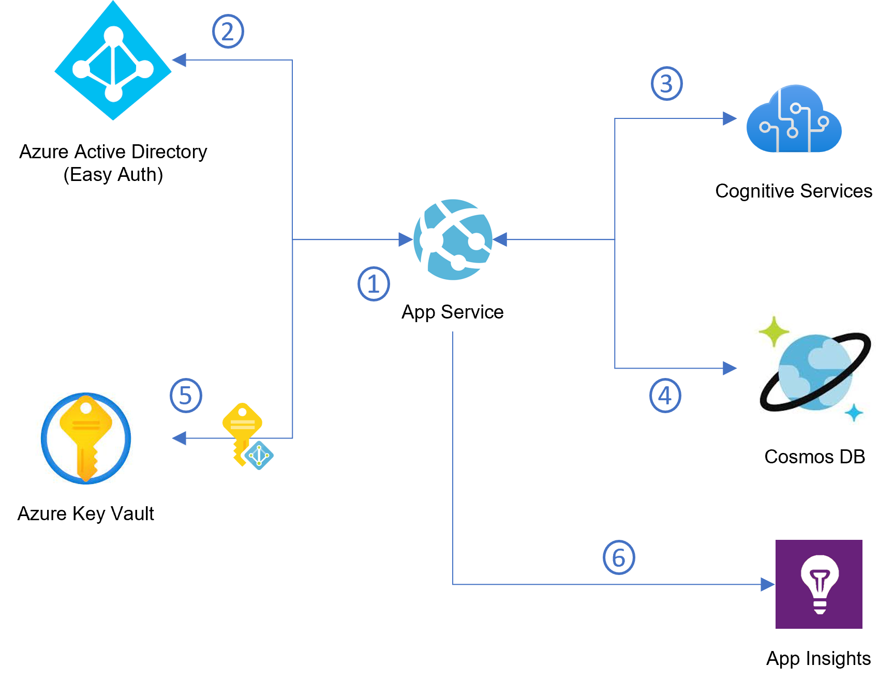

# Feedback Manager for Codemotion Webinar

This project is the demo proposed for the webinar (here add the link to the recording version of the webinar).

It's a simple solution for entering textual feedback into a database with sentiment analysis.

## Architecture

In the following picture you can see the solution architecture:

1. The App Service hosts the application (.NET 6.0) that allows the user to add a feedback;
2. The user must be authenticated, the AppService can use [EasyAuth (built-in authentication module)](https://learn.microsoft.com/en-us/azure/app-service/overview-authentication-authorization) to add, in a simple way, an authentication layer to the web application without write code in it;
3. Cognitive Service (sentiment analysis opinion mining for Language) is used to understand the language of the feedback and scoring the sentiment;
4. The feedback and the sentiment analysis report are inserted in the CosmosDB account;
5. The configuration secrets used to access to Cognitive Service instance and CosmosDB Account are stored in a Key Vault and retrieved by the App Service using a Managed Identity;
6. The App Service writes its log into Application Insights for monitoring
